# 🔄 Git Panel — DevGit Dashboard

> **Location in Dashboard:** Left sidebar → `Git` tab  
> **Last updated:** 2026-09-24  
> **User Guide:** For practical setup examples and walkthroughs, see [HOW_TO_USE.md](HOW_TO_USE.md).

---

## Table of Contents

1. [Overview](#overview)
2. [Architecture](#architecture)
3. [Card States](#card-states)
4. [Card Layout Anatomy](#card-layout-anatomy)
5. [Action Buttons](#action-buttons)
6. [Branch Insights — Behind Branches](#branch-insights--behind-branches)
7. [AI Commit State Machine](#ai-commit-state-machine)
8. [Diverged Repo Flow](#diverged-repo-flow)
9. [Conflict Resolution Flow](#conflict-resolution-flow)
10. [Interactive Git Terminal](#interactive-git-terminal)
11. [Gitflow Developer Console](#gitflow-developer-console)
12. [Repository Detail Screen (Screen 2)](#repository-detail-screen-screen-2)
13. [Branch Category Tabs](#branch-category-tabs)
14. [Commit History Modal](#commit-history-modal)
15. [Merge Branch Modal — Searchable Branch Picker](#merge-branch-modal--searchable-branch-picker)
16. [Multi-Repo Failure Alerts](#multi-repo-failure-alerts)
17. [Data Refresh Lifecycle](#data-refresh-lifecycle)
18. [Code Paths Reference](#code-paths-reference)
19. [API Endpoints](#api-endpoints)
20. [API Mappings & Frontend Triggers](#api-mappings--frontend-triggers)
21. [localStorage Keys](#localstorage-keys)
22. [Change Log](#change-log)

---

## Overview

The Git panel gives a real-time, visual dashboard for every git repository in the workspace. It scans all repos under `/apps/` and `/packages/`, displays their sync status with remote, and offers one-click actions (Pull, Push, AI Commit, Branch management).

**Repos discovered from:** `/api/git/repos`  
**Grouped into:** Apps | Packages

---

## Architecture

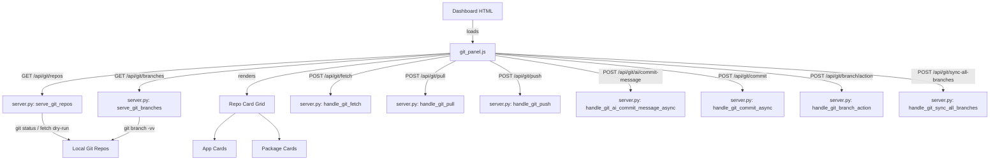

---

## Card States

Each repo card has exactly **one** state at any time. Priority order (top = highest):

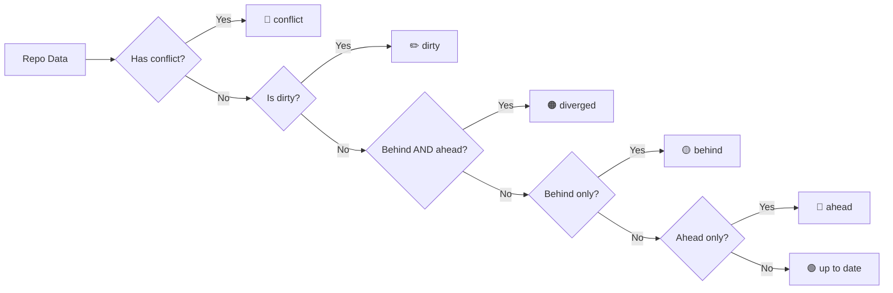

| State | Border Color | Status Pill | Meaning |
|-------|-------------|-------------|---------|
| `up to date` | green `#2da84e` | `up to date` | Fully synced with remote |
| `behind` | yellow `#ffd566` | `N behind` | Remote has N commits you don't have locally |
| `ahead` | blue `#8ab4ff` | `N ahead` | You have N local commits not yet pushed |
| `diverged` | red `#ff8a8a` | `diverged` | Both you and remote have new commits — needs rebase or merge |
| `dirty` | orange `#f2a63b` | `N changes` | Uncommitted local file changes |
| `conflict` | pink `#ff5a71` | `conflict` | Active merge conflict — needs manual resolution |
| `fetching` | blue `#3b82f6` | animated | Currently fetching from remote |

> **Code:** `tool/ui/frontend/js/git_panel.js` L155–L179

---

## Card Layout Anatomy

```
┌─────────────────────────────────────────────┐  ← border-top color = state
│  [app icon]               [status pill]     │  ← headerHtml
│                                             │
│  customer_app                               │  ← name (bold)
│  main → origin/main                         │  ← branch → upstream
│  Fetched 2m ago                             │  ← lastFetchedAt
│                                             │
│  [↓4 main              ▾]    [sync]        │  ← dropdownHtml + badge
│                                             │
│  ┌ Branch Updates ────────────── [SYNC ALL] │  ← insightsHtml
│  │ ↓ origin/main     [4 behind]            │
│  │ [↓ Pull Updates] [→ Merge main here]    │
│  │ [← Integrate into main]                  │
│  └──────────────────────────────────────────│
│                                             │
│  [↓ Update]  [↑ Push]  [✨ AI Commit]      │  ← buttonsGridHtml
└─────────────────────────────────────────────┘
```

> **Code:** `git_panel.js` L400–L411 — `return <div class="git-repo...">`

---

## Action Buttons

### ↓ Update (Pull)

Pulls incoming commits from remote onto the currently selected branch.

- **Active when:** `behind > 0`
- **Glow:** blue `glow-blue`
- **On conflict:** turns red, shows `⟳ Retry`
- **API:** `POST /api/git/pull`
- **Backend:** `server.py` L6353 — `handle_git_pull`

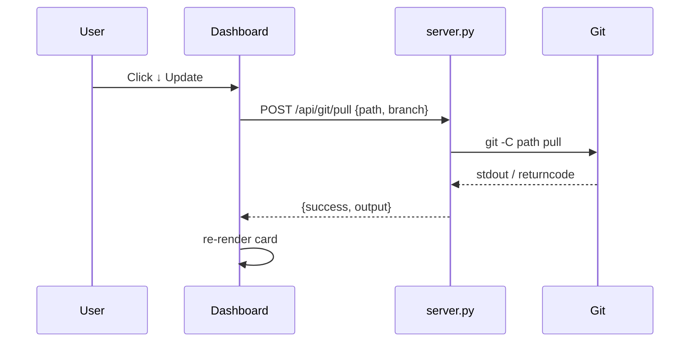

---

### ↑ Push

Pushes local commits to remote upstream.

- **Active when:** `ahead > 0 AND behind == 0 AND hasUpstream AND isFresh`
- **Glow:** green `glow-green`
- **Disabled if:** no upstream configured, or fetch not fresh (< 5 min)
- **API:** `POST /api/git/push`
- **Backend:** `server.py` L6430 — `handle_git_push`

> The `isFresh` check prevents accidentally pushing when ahead/behind counts may be stale (last fetch > 5 minutes ago).

---

### ✨ AI Commit

Generates a git commit message using AI based on the current diff, then commits.

- **Active when:** `dirty == true`
- **Shows:** "Generating…" while running (async)
- **State persisted in:** `localStorage` key `devgit_ai_commit_cache_v1`
- **APIs:**
    - Generate: `POST /api/git/ai/commit-message`
    - Commit: `POST /api/git/commit`
- **Backend:**
    - `server.py` L5878 — `handle_git_ai_commit_message_async`
    - `server.py` L5983 — `handle_git_commit_async`

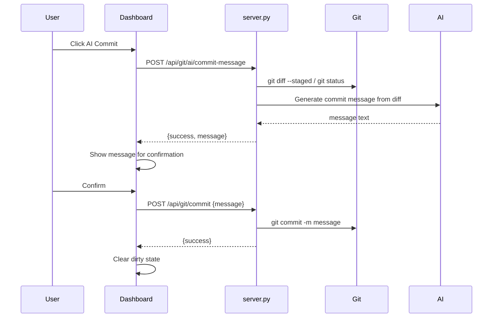

---

## Branch Insights — Behind Branches

Appears **inside the card** when any remote branch (other than current HEAD) is behind its remote.

> **Code:** `git_panel.js` L765–L827 — `getBranchInsightsHtml()`

### Filter Logic

- Only branches where `behind > 0` AND `branch !== HEAD`
- Only branches updated within the **last 15 days** (staleness filter)
- Sorted by most-behind first

### Per-Branch Actions Explained

| Button | Label | What it does | Actual git command |
|--------|-------|-------------|-------------------|
| 🔵 Pull | `↓ Pull Updates` | Downloads remote commits into **that background branch** | `git checkout <branch> && git pull` |
| 🩷 Merge current | `→ Merge [HEAD] here` | Merges your **active working branch** INTO the listed branch. Keeps the listed branch current with your work. | `git checkout <branch> && git merge <HEAD>` |
| 🟢 Integrate | `← Integrate into [HEAD]` | Merges the **listed branch** INTO your active branch. Brings that branch's commits into your workspace. | `git merge <branch>` (while on HEAD) |

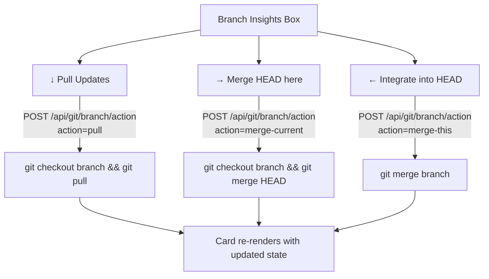

### SYNC ALL Button

Syncs all fast-forwardable branches automatically.

- **API:** `POST /api/git/sync-all-branches`
- **Backend:** `server.py` L6540 — `handle_git_sync_all_branches`

### Branch Action API

- **Endpoint:** `POST /api/git/branch/action`
- **Backend:** `server.py` L6606 — `handle_git_branch_action`
- **Payload:** `{ path, branch, action: "pull" | "merge-current" | "merge-this" }`

---

## AI Commit State Machine

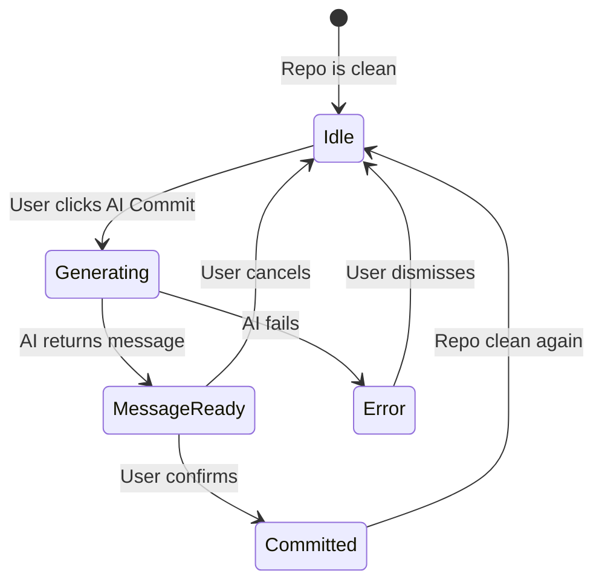

State persisted per `repoPath::branch` in `localStorage`:

```json
{
  "/path/to/repo::main": {
    "status": "generating | ready | idle",
    "message": "feat: add X",
    "updatedAt": 1234567890
  }
}
```

> **Code:** `git_panel.js` L58–L90 — AI state helpers

---

## Diverged Repo Flow

When a repo has **both ahead AND behind** commits, two resolution buttons appear:

| Button | Action | Git command |
|--------|--------|-------------|
| 🛠 Resolve Diverged (Rebase) | Replay your commits on top of remote | `git pull --rebase` |
| 🧩 Resolve Diverged (Merge) | Merge remote into local (creates merge commit) | `git pull --no-rebase` |

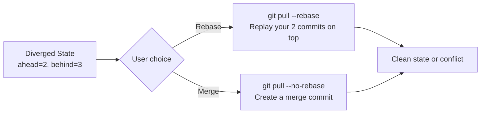

> **Code:** `git_panel.js` L352–L353

---

## Conflict Resolution Flow

When `git pull` or a merge produces a conflict:

1. Card state → `conflict` (stored in `_gitConflictRepos` Map)
2. Card shows ⚠️ icon + `conflict` status pill
3. Expandable error box shows the conflict message + commands:
    - `git -C "<path>" status`
    - `git -C "<path>" merge --abort`
    - "Resolve files, then commit"
4. Update button shows `⟳ Retry`

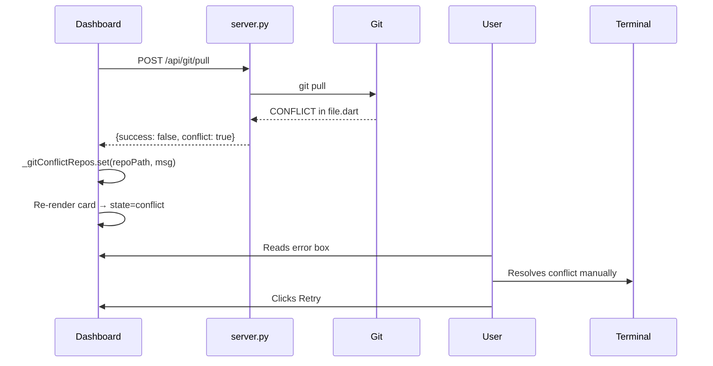

> **Code:**
> - Conflict detection: `git_panel.js` L160–L163
> - Error box HTML: `git_panel.js` L284–L297

---

## Interactive Git Terminal

A full terminal at the bottom of the Git tab for raw git commands.

- **Repo selector:** dropdown auto-populated from all repos
- **API:** `POST /api/git/terminal/run`
- **Backend:** `server.py` L6074 — `handle_git_terminal_run`
- **Output:** shown in scrollable console pane

---

## Gitflow Developer Console

The Gitflow Developer Console is a client-side simulated dashboard integrated dynamically at the bottom of the Git panel. It activates whenever a repository (App or Package card) is selected.

### Layout & Component Structure

- **System Metrics Bar**:
  - **Active Branches**: Count of total branches and breakdown (Main, Release, Feature).
  - **Production Status**: Display of current production tag (e.g. `v1.1.4`) and count of hotfixes finalized during the monthly cycle.
- **Branch Explorer Panel**:
  - **Dynamic Search**: Interactive search input field to filter branches live on keystroke by branch name.
  - **Type Tabs**: Filters by branch type (`ALL`, `MAIN`, `DEVELOP`, `FEATURE`, `RELEASE`, `HOTFIX`, `BUGFIX`).
  - **Branch Overview Table**: Table listing branch names, dynamic locks (`🔒 Locked to develop` or `🔒 Locked to main`), and ahead/behind commit statuses.
- **Release History Log (Bottom)**:
  - **Git Tags Integration**: Real-time tags parsed from the git repository tags history log.
  - **Commit-Categorized Changelogs**: Automatically extracts the latest 10 commits per tag and splits them into `✨ New Features` and `🐛 Bug Fixes` dynamically based on commit message prefixes.

### Gitflow Rule Enforcement & Naming Engine

- **Base Branch Selection**: Base branch is a dropdown dynamically listing all branches available in the repository. It auto-selects the recommended default based on branch type:
  - `feature` / `release` / `bugfix`: defaults to `develop`.
  - `hotfix`: defaults to `main`.
- **Naming Conventions**: Auto-generated format using specific plural/singular folder structure prefixes:
  - `feature` $\rightarrow$ `features/{version-scope}/{ticket-name}` (e.g. `features/v1.1.3/referral-program`)
  - `bugfix` $\rightarrow$ `bugfix/{version-scope}/{ticket-name}` (e.g. `bugfix/v1.1.3/referral-program`)
  - `release` $\rightarrow$ `releases/{version-scope}/{ticket-name}` (e.g. `releases/v1.1.3/referral-program`)
  - `hotfix` $\rightarrow$ `hotfix/{version-scope}/{ticket-name}` (e.g. `hotfix/v1.1.3/referral-program`)
- **Live CLI Code Preview**: Live generated command updating in real-time as the developer inputs: `git checkout -b {target_branch} {selected_base_branch}`.

### State & Caching

The Gitflow state is completely managed client-side per repository using a `Map` cache inside `gitflow_panel.js`.
```javascript
const _gitflowStateByRepo = new Map();
// Cache schema: repoPath -> { activeBranchesCount, productionVersion, ciCdHealth, selectedTab, selectedReleaseIndex, branches[], releaseLogs[] }
```

---

## Repository Detail Screen (Screen 2)

Clicking any repo card on the main grid (`#gitScreen1`) opens a full-page **branch detail view** (`#gitScreen2`) for that single repository — this is a separate screen swap, not a modal.

> **Code:** `index.html` L288–L325 (`#gitScreen2` markup) · `app.js` L604 — `window.openRepoDetailScreen(rawPath, silent)`

### Layout

```
← Back to Repositories   web_app  [DEVELOP] [UP-TO-DATE] [21 BRANCHES]     [Tag Release] [View Tags] [+ Start Branch]
🔍 Search branches by name, feature, or version...
[ All ●21 ] [ BUGFIX/ ●3 ] [ FEATURE/ ●1 ] [ FEATURES/ ●10 ] [ PO/ ●2 ] [ RELEASES/ ●3 ] [ STANDARD BRANCHES ●2 ]
⚡ Pending Actions (branches with ahead/behind commits — always shown regardless of the active tab)
BUGFIX/  ●3
  V1.1.3 ●2
    [branch card] [branch card]
  V1.0.0 ●1
    [branch card]
```

- **Header bar** — Back button, repo name, HEAD branch badge, sync-status badge (`Up-to-Date` / `Pending Changes` / `Conflict`), total branch count, and the Tag Release / View Tags / Start Branch actions.
- **Search bar** (`#gs2SearchInput`) — filters `_gs2AllBranches` by substring match on branch name, live on keystroke. See [Branch Category Tabs](#branch-category-tabs) for how search and tabs combine.
- **Pending Actions** — a cross-cutting section (unaffected by the active tab) listing any branch with `ahead > 0 || behind > 0`, with quick Pull/Push/Fetch/Check Out buttons.
- **Branch cards** — grouped by prefix (see below), each with Fetch / Check Out / Rename / Commits / Merge / Delete actions.

### State

| Variable | Purpose |
|----------|---------|
| `_gs2ActiveRepoPath` | The repo currently shown in Screen 2; reset to `''` on Back |
| `_gs2AllBranches` | Full unfiltered branch list for the active repo, from `GET /api/git/branches` |
| `_gs2ActiveGroupKey` | Which category tab is selected (`'all'` or a group's `colorKey`); reset to `'all'` on repo switch or Back |

### Key Functions

| Function | Purpose |
|----------|---------|
| `openRepoDetailScreen(rawPath, silent)` | Entry point — hides Screen 1, shows Screen 2, loads branches, resets tab state |
| `_gs2RenderBody(rawPath, branches, head)` | Renders Pending Actions + tab bar + the active tab's branch groups into `#gs2Body` |
| `_gs2FilterBranches(query)` | Re-filters `_gs2AllBranches` by the search box and re-renders |
| `_gs2GroupBranches(branches)` | Buckets branches by their prefix folder (`bugfix/`, `feature/`, …) |
| `_gs2BuildGroup(rawPath, group, head)` | Renders one group's branch cards, further nested by version subfolder |

---

## Branch Category Tabs

**Problem this solves:** with many branch prefixes (`bugfix/`, `feature/`, `features/`, `releases/`, …) each holding several version subfolders, Screen 2's branch list used to be one long vertical scroll of every category stacked on top of each other.

**Fix:** the categories (already computed by `_gs2GroupBranches`) are now presented as a tab strip, so only one category's branches render at a time.

> **Code:** `app.js` L759 — `_gs2RenderBody()` · L794 — `_gs2BuildTabBar()` · L826 — `_gs2SelectGroupTab()`

### Behavior

- **Dynamic tabs** — one tab per prefix actually present in the repo (`All` + whatever `_gs2GroupBranches` discovers), each showing a live branch count badge. A repo with no `hotfix/` branches simply has no `HOTFIX/` tab.
- **Widget reuse** — the tab bar is the design system's generic segmented-control component (`.ui-segmented` / `.ui-segmented-item`, the same widget used for "Group: Folder / Group: Filename" elsewhere in the dashboard), not custom one-off markup. The active tab renders with the shared solid-indigo `.ui-active` state; its count badge gets a light overlay style so it stays legible against the indigo fill.
- **Search + tabs compose** — typing in the search box filters within the active tab; switching tabs preserves whatever search query is active. If a search matches nothing in the selected tab but does match elsewhere, the tab bar itself shrinks to only the tabs with matches, and the branch area shows *"No branches match your search in this category. Try the 'All' tab."*
- **State resets** — the selected tab always resets to `All` when you open a different repo or hit "Back to Repositories", so you never land on a stale/invalid tab for the next repo.

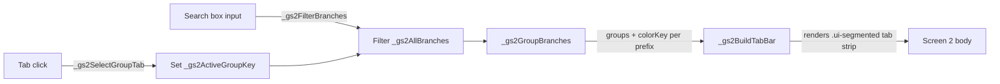

---

## Commit History Modal

Clicking **Commits** on any branch card opens `#gitCommitsModal`, listing that branch's recent commits.

> **Code:** `app.js` L2290 — `openBranchCommitsScreen()` · L2235 — `_renderGitCommitRow()` · L2266 — `_filterGitCommits()` · Backend: `router.py` L648 — `serve_git_commits()`

### What it shows per commit

| Field | Source | Notes |
|-------|--------|-------|
| Short hash | `c.sha` (`git log %h`) | Selectable text (`user-select: text`) despite living inside a `.ui-badge`, which is `user-select: none` by default |
| Full hash | `c.fullSha` (`git log %H`) | Shown as a tooltip on the hash badge; copied via the copy-icon button |
| Message | `c.message` | Word-wrapped, full contrast text |
| Author / relative date | `c.author`, `c.date` | Relative date (`%ar`) shown; absolute date (`c.dateAbsolute`, `%ad`) shown as a tooltip |
| Diff stats | `c.filesChanged` / `c.insertions` / `c.deletions` | Parsed from a single `git log --numstat` call — no per-commit subprocess calls |
| GitHub link | `c.webUrl` | Only present when `origin` resolves to a `github.com` remote; opens the commit there |

### Actions

- **Copy hash** — `copyTextToClipboard()` (`app.js` L90) copies the *full* SHA (not the shortened one shown), using the async Clipboard API with a `document.execCommand('copy')` fallback for contexts where clipboard permission is denied. Confirmation/failure shown via `showGitflowToast(title, body, type)`.
- **Filter** — `#gitCommitsSearchInput` (auto-shown once a branch has more than 5 commits) filters the already-loaded `_gitCommitsCache` client-side by message, author, or hash — no extra requests.
- **View on GitHub** — external-link icon, only rendered when the repo's `origin` remote is a GitHub URL.

### Fixed: card-collapse bug

Each commit was rendered as a `.ui-card` (which has `overflow: hidden`) inside a `display:flex; flex-direction:column` list. Per the flexbox spec, `overflow` other than `visible` drops a flex item's *automatic minimum size* to `0`, so every card was flex-shrinking down to a ~22px sliver instead of the list scrolling — clipping the message/author lines and most of the hash. Fixed by giving each card `flex-shrink: 0`. The muted text color (`#64748b`) also fell below the WCAG AA 4.5:1 contrast threshold at ~3.75:1 against the card background; bumped to `#94a3b8` (~7:1).

---

## Merge Branch Modal — Searchable Branch Picker

`#gitMergeModal`, opened via the **Merge** button on a branch card (`openGitMergeModal(repoPath, branch, btn)`, `app.js` L2475).

> **Code:** `app.js` L2371 — `_createGitBranchPicker()` (reusable widget) · L2475 — `openGitMergeModal()` · `index.html` L662–L693

### The branch picker widget

Both the **FROM** and **INTO** fields use the same reusable combobox (`_createGitBranchPicker`), each with its own instance (`_gitMergeSourcePicker`, `_gitMergeTargetPicker`):

| State | Behavior |
|-------|---------|
| Closed | Renders as a pill: branch icon + name + ✕. Clicking anywhere on the pill (or the ✕) opens it. |
| Open | Renders an autofocused search input + a scrollable, live-filtered branch list (`role="listbox"`). Typing filters in real time; clicking an item selects it and collapses back to a pill. |
| Outside click | A document-level (capture-phase) click listener closes the picker back to its pill if the click lands outside its container — including when the click is on the *other* picker, which closes this one and opens that one. |

- **Mutual exclusion** — each picker's `excludeGetter` reads the other picker's live value, so FROM and INTO can never both resolve to the same branch; picking a value in one live-refreshes the other's list if it's open.
- **FROM is now editable** — previously the source branch was a fixed, read-only field bound to whichever branch card's Merge button was clicked. It's now a full picker like INTO, so you can change either side without closing and reopening the modal from a different branch.
- **Swap button** (`#gitMergeSwapBtn`) — the circular ⇅ button between the two fields swaps FROM and INTO's values in one click (closing either picker first if it happened to be open), with a brief 180° spin for feedback.

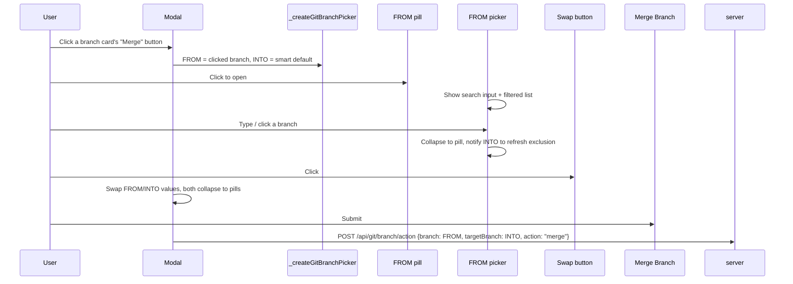

---

## Multi-Repo Failure Alerts

The backend reports a multi-repo action failure (pull/push/fetch/checkout/rename/merge) as **one flat string**: `"<Verb> failed on some repositories:\n<repo>: <message>\n..."` (see e.g. `router.py` L1961 for merge). Individual repos' messages can themselves span multiple lines of raw git output.

> **Code:** `app.js` L221 — `formatAlertMessage()` · L137 — `_formatRepoFailureBlocks()` · L235 — `window.showGitAlert()` (also used by the global `window.alert` monkey-patch)

### The bug that was fixed

The previous renderer split the whole message on `\n` and treated **every line independently**, card-ifying any line with a colon in it. Since raw git output (`CONFLICT (content): Merge conflict in <file>`, `Automatic merge failed; fix conflicts and then commit the result.`) also contains colons, one repo's multi-line failure fragmented into a run of bogus cards — including a phantom `📂 CONFLICT (CONTENT)` card and an empty `📂 MERGE FAILED ON SOME REPOSITORIES` card, with no indication of which repo or files were actually involved.

### The fix

`_formatRepoFailureBlocks()` only starts a *new* repo block when the text before a line's colon looks like a bare identifier (`^[A-Za-z0-9_.-]+$` — an actual repo/package name, no spaces or parens). Everything else is treated as a continuation of the currently-open repo's message. Each repo then renders as **one** card:

- **Conflicted files** parsed out of `CONFLICT (...): ...` lines and shown as a clean bulleted list, when present.
- **The failure reason shown directly** (not hidden behind a click) when there's no file list to lead with — e.g. `Working tree has uncommitted changes`.
- **Raw git output** available behind a "Show raw git output" `<details>` toggle for anything beyond the headline reason.
- **A one-line next-step hint** ("Resolve the conflicts in the listed file(s)... then commit and push before retrying") shown once, above the cards, whenever any repo has actual conflicts.

Because this is one shared function behind `window.alert`, the fix applies to every action that produces this string shape (pull/push/fetch/checkout/rename/merge), not just merge.

---

## Data Refresh Lifecycle

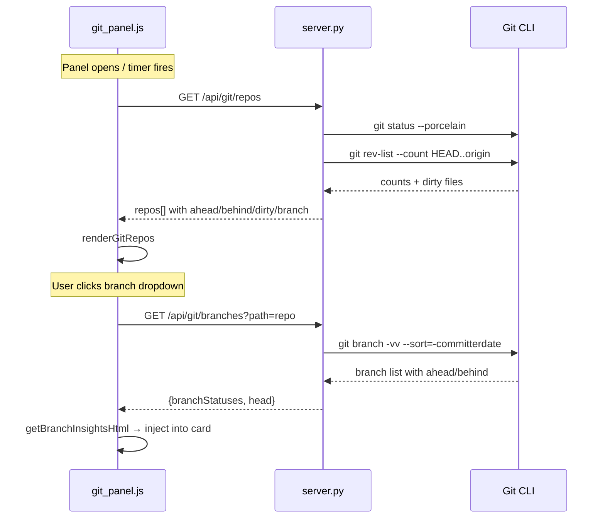

### Delta Animation

If `ahead` or `behind` changed since last render, the card pulses (CSS `pulse` for 1.2s).

> **Code:** `git_panel.js` L19–L26 — `_applyGitDeltaAnimation()`

---

## Code Paths Reference

### Frontend Files

| File | Purpose |
|------|---------|
| `frontend/index.html` | Git updates panel and main dashboard UI |
| `frontend/styles.css` | Styles for panel and Gitflow console |
| `frontend/app.js` | Core logic — render, events, API calls |
| `frontend/gitflow_panel.js` | Gitflow developer console feature logic |
| `workspace_assets/apps_config.json` | Optional app icon/color/ID config |

### Key Functions in `app.js` & `gitflow_panel.js`

| Function | File | Purpose |
|----------|------|---------|
| `renderGitRepos(repos)` | `app.js` | Main renderer — builds all cards |
| `mkRow(r)` | `app.js` | Renders one repo card HTML |
| `getBranchInsightsHtml()` | `app.js` | "Branch Updates" insights box |
| `loadGitRepos()` | `app.js` | Fetches repos API + renders |
| `startGitFetch()` | `app.js` | Initiates git fetch |
| `_applyGitDeltaAnimation()` | `app.js` | Pulse animation on sync change |
| `_pushGitHistory()` | `app.js` | Saves op history to localStorage |
| `_getAiState()` | `app.js` | Reads AI commit state |
| `_setAiState()` | `app.js` | Writes AI commit state |
| `initGitflowRepoState(repoPath)` | `gitflow_panel.js` | Initializes or retrieves repository Gitflow state |
| `selectGitflowRepo(repoPath, cardElement)` | `gitflow_panel.js` | Marks active card, syncs terminal, opens console |
| `renderGitflowConsole(repoPath)` | `gitflow_panel.js` | Generates dashboard HTML structure and UI views |
| `updateGitflowModalOutputs()` | `gitflow_panel.js` | Rules validator, naming engine, and checkout command previewer |
| `showGitflowToast(title, body, type)` | `gitflow_panel.js` | Triggers toast slide-in notifications (`type: 'success' \| 'error'` selects the icon) |
| `openRepoDetailScreen(rawPath, silent)` | `app.js` | Opens Screen 2 for a repo, resets tab/search state |
| `_gs2RenderBody(rawPath, branches, head)` | `app.js` | Renders Pending Actions + tab bar + active tab's branch groups |
| `_gs2BuildTabBar(groups, activeKey)` | `app.js` | Renders the `.ui-segmented` category tab strip |
| `_gs2SelectGroupTab(key)` | `app.js` | Switches the active category tab, preserving the search query |
| `_gs2GroupBranches(branches)` | `app.js` | Buckets branches by prefix folder (`bugfix/`, `feature/`, …) |
| `openBranchCommitsScreen(branchName, repoPath, btn)` | `app.js` | Opens the Commit History modal and loads/renders commits |
| `_renderGitCommitRow(c)` | `app.js` | Renders one commit card (hash, copy button, GitHub link, stats) |
| `copyTextToClipboard(text)` | `app.js` | Clipboard API with an `execCommand('copy')` fallback |
| `_createGitBranchPicker(opts)` | `app.js` | Reusable searchable branch combobox (pill ⇄ search+list) |
| `openGitMergeModal(repoPath, branch, btn)` | `app.js` | Opens the Merge Branch modal with FROM/INTO pickers + swap |
| `formatAlertMessage(message)` / `_formatRepoFailureBlocks(message)` | `app.js` | Renders `window.alert`/`showGitAlert` bodies; groups multi-repo failures into one card per repo |

### Backend Handlers in `backend/server.py` & `backend/router.py`

| Handler | Source | Endpoint |
|---------|--------|---------|
| `serve_git_repos()` | `router.py` | GET /api/git/repos |
| `_serve_workspace()` | `server.py` | GET /api/workspace |
| `_handle_workspace_switch()` | `server.py` | POST /api/workspace/switch |
| `serve_git_branches()` | `router.py` | GET /api/git/branches |
| `serve_git_status()` | `router.py` | GET /api/git/status |
| `serve_git_diff()` | `router.py` | GET /api/git/diff |
| `serve_git_changes()` | `router.py` | GET /api/git/changes |
| `handle_git_fetch()` | `router.py` | POST /api/git/fetch |
| `handle_git_pull()` | `router.py` | POST /api/git/pull |
| `handle_git_push()` | `router.py` | POST /api/git/push |
| `handle_git_stash_pull_pop()` | `router.py` | POST /api/git/stash-pull-pop |
| `handle_git_sync_all_branches()` | `router.py` | POST /api/git/sync-all-branches |
| `handle_git_branch_action()` | `router.py` | POST /api/git/branch/action (checkout, rename, pull, push, delete, **merge**, …) |
| `handle_git_ai_commit_message_async()` | `router.py` | POST /api/git/ai/commit-message |
| `handle_git_commit_async()` | `router.py` | POST /api/git/commit |
| `handle_git_terminal_run()` | `router.py` | POST /api/git/terminal/run |
| `serve_git_commits()` | `router.py` | GET /api/git/commits |

---

## API Endpoints

### GET

| Endpoint | Query | Response fields |
|----------|-------|----------------|
| `/api/git/repos` | — | `repos[]: {name, path, branch, upstream, ahead, behind, dirty, dirtyFiles, aheadBranches, lastFetchedAt, hasUpstream, remoteHealth}` |
| `/api/git/branches` | `?path=` | `{head, branchStatuses[]: {name, behind, ahead, updatedAt}}` |
| `/api/git/status` | `?path=` | repo status fields |
| `/api/git/diff` | `?path=` | `{diff: "..."}` |
| `/api/git/changes` | `?path=` | `{files: [...]}` |
| `/api/git/commits` | `?repoPath=&branch=` | `{commits[]: {sha, fullSha, author, authorEmail, date, dateAbsolute, message, filesChanged, insertions, deletions, webUrl}}` — last 50 commits, one `git log --numstat` call |

### POST

| Endpoint | Body | Response |
|----------|------|---------|
| `/api/git/fetch` | `{path, scope}` | `{success, output}` |
| `/api/git/pull` | `{path, branch}` | `{success, output, conflict}` |
| `/api/git/push` | `{path, branch}` | `{success, output}` |
| `/api/git/commit` | `{path, message}` | `{success}` |
| `/api/git/ai/commit-message` | `{path, branch}` | `{success, message}` |
| `/api/git/branch/action` | `{path, branch, action}` (merge also sends `targetBranch`, `useMelos`) | `{success, output}`; merge failures include a structured-friendly flat `error` string — see [Multi-Repo Failure Alerts](#multi-repo-failure-alerts) |
| `/api/git/sync-all-branches` | `{path}` | `{success, results[]}` |
| `/api/git/stash-pull-pop` | `{path}` | `{success, output}` |
| `/api/git/terminal/run` | `{path, command}` | `{success, output}` |

---

## API Mappings & Frontend Triggers

This section maps backend API endpoints directly to their corresponding triggers and user interactions inside the dashboard.

| API Endpoint | HTTP Method | Frontend Function | UI Trigger Element / Screen Interaction |
|--------------|-------------|-------------------|------------------------------------------|
| `/api/git/repos` | `GET` | `loadGitRepos()` | Fired automatically on page load, on manual Refresh button click, and after actions finish. |
| `/api/git/branches` | `GET` | `onRepoListChange()` | Fired when changing the active branch selection dropdown on a repository card. |
| `/api/git/fetch` | `POST` | `startGitFetch()` | Fired when clicking the primary **Git Fetch All** button or a single repository's Fetch button. |
| `/api/git/pull` | `POST` | `runGitPull()` | Fired when clicking the blue **↓ Update** (Pull) button on a repository card. |
| `/api/git/push` | `POST` | `runGitPush()` | Fired when clicking the green **↑ Push** button on a repository card. |
| `/api/git/ai/commit-message` | `POST` | `generateAiCommitMessage()` | Fired inside the AI Commit modal when clicking the **✨ Generate** commit message button. |
| `/api/git/commit` | `POST` | `aiGenerateThenCommit()` | Fired inside the AI Commit modal when clicking **Create Commit** or **Commit & Push**. |
| `/api/git/branch/action` | `POST` | `runGitBranchAction()` | Fired when clicking **↓ Pull Updates** or **← Integrate into HEAD** inside the Branch updates box. |
| `/api/git/branch/action` (`action: "merge"`) | `POST` | `openGitMergeModal()`'s submit handler | Fired when clicking **Merge Branch** in the Merge Branch modal (Screen 2 branch card → **Merge**). |
| `/api/git/commits` | `GET` | `openBranchCommitsScreen()` | Fired when clicking **Commits** on a branch card in Screen 2. |
| `/api/git/sync-all-branches` | `POST` | (Click handler) | Fired when clicking the **SYNC ALL** button in the branch updates header. |
| `/api/git/stash-pull-pop` | `POST` | `runGitStashPullPop()` | Fired when clicking the **Stash, Pull & Pop** button on dirty diverged cards. |
| `/api/git/terminal/run` | `POST` | (Click/Keypress handler) | Fired when clicking **Execute** or pressing Enter inside the Git Terminal Console. |

> **Note on Gitflow Console Operations:** All Gitflow operations (`Start Branch`, `Initiate Release`, `Finalize Release`, `Delete Branch`) are completely client-side simulated for instant responses and do not call backend endpoints.

---

## localStorage Keys

| Key | What's stored |
|-----|--------------|
| `devgit_git_favorites_v1` | Set of repo paths marked as favorites |
| `devgit_git_op_history_v1` | Last 5 ops per repo: `{action, ok, durationMs}` |
| `devgit_ai_commit_cache_v1` | AI commit state per `repoPath::branch` |
| `devgit_github_token_v1` | GitHub Personal Access Token |

---

## Change Log

| Date | Change | Files |
|------|--------|-------|
| 2026-06-27 | Removed: safe mode dropdown, batch actions, favorites, checkboxes | `dashboard.html`, `git_panel.js` |
| 2026-06-27 | Removed: recent ops bar, footer bar, fetch/stash/preview buttons | `git_panel.js` |
| 2026-06-28 | Made cards compact: padding 16→12, gap 8→6, radius 16→12 | `git_panel.css` |
| 2026-06-28 | Added focus-within ring for keyboard accessibility | `git_panel.css` |
| 2026-06-28 | App icons from `apps_config.json` via `/api/app-icon` proxy | `git_panel.js` |
| 2026-06-28 | 4-column grid: `repeat(4, minmax(0, 1fr))` | `git_panel.css` |
| 2026-06-28 | Fixed overflow: `min-width: 0` on dropdown container + select | `git_panel.css` |
| 2026-07-04 | Improved Branch Updates UI: clearer button labels, shorter header | `git_panel.js` |
| 2026-07-04 | Allowed long behind branch names to wrap onto multiple lines without ellipsis | `git_panel.css` |
| 2026-07-04 | Filtered out branches already merged into HEAD from Branch Updates list | `server.py`, `git_panel.js` |
| 2026-07-04 | Created this document | `docs/README.md` |
| 2026-07-10 | Imported `core_utils.js` to fix `ReferenceError: apiUrl is not defined` inside Git updates iframe | `index.html` |
| 2026-07-11 | Injected `_discover_git_repos` and `_git_repo_status` into `git_router`, corrected the module-relative `parents[3]` pathing to `parents[5]` for the workspace root, and resolved `self` NameErrors / request-parsing bugs inside modular router functions. | `server.py`, `router.py` |
| 2026-07-13 | Fixed JavaScript ReferenceError (`PathBasename`) inside status poller thread and added premium linear gradient buttons | `app.js`, `styles.css` |
| 2026-07-19 | Removed redundant tab reload calls in the parent window container to preserve state | `dashboard.js` |
| 2026-08-03 | Implemented the Gitflow Developer Console with metric summary cards, branch explorer table with locked base branches, interactive start branch modal with naming convention validation, flow diagram, and scrolling release history log. | `index.html`, `styles.css`, `gitflow_panel.js` |
| 2026-08-03 | Updated branch type to lowercase with minimal descriptions, converted base branch to a dropdown selector of available branches, applied plural/singular prefixes for targets (features/releases/bugfix/hotfix), and styled cancel button as secondary. | `index.html`, `styles.css`, `gitflow_panel.js` |
| 2026-08-03 | Removed CI/CD metric card, branch table emoji icons, QA Signals, Actions headers/columns, and the entire right-side Release Operations Console block. | `index.html`, `styles.css`, `gitflow_panel.js` |
| 2026-08-03 | Added dynamic branch search input to filter branches live on keystroke without losing focus, and fully integrated tags and release history logs with git commit categories. | `index.html`, `gitflow_panel.js` |
| 2026-08-03 | Added collapsible Gitflow Strategy & Release Guide card panel to console header, and implemented dynamic description cards explaining the lifecycle rules of each branch type when selecting search filter tabs. | `index.html`, `gitflow_panel.js` |
| 2026-08-03 | Implemented local repository JSON file caching (`git_repos_cache.json`) for instant landing loads, added "Refresh Repositories" workspace scanner action button, and hooked automatic cache sync updates on individual repo status pulls/commits. | `index.html`, `app.js`, `router.py` |
| 2026-08-04 | Implemented interactive Git Stash Manager (Apply & Drop), selective file staging check list in AI commit modal, automated GitHub Actions CI/CD status badges, and the interactive Conflict Resolution Assistant modal (Ours vs Theirs). | `index.html`, `app.js`, `gitflow_panel.js`, `server.py`, `router.py` |
| 2026-08-05 | Improved Git panel designs: simplified screen layout, removed top border colored state overlays on cards, removed default center-right 'sync' badge, and removed package icons from package cards. | `styles.css`, `app.js` |
| 2026-08-05 | Cleaned up branch explorer table columns (removed Commit Status, CI Run, Actions), completely removed Git Stash Manager and Release History Log panels, and added premium gradient styling to the Start Branch button. | `index.html`, `styles.css`, `gitflow_panel.js` |
| 2026-08-05 | Added "Automatically check out new branch" checkbox in Gitflow branch modal, configured command preview to display git checkout -b vs git branch commands dynamically, and wired to backend POST handler. | `index.html`, `gitflow_panel.js`, `router.py` |
| 2026-08-13 | Implemented monorepo release tagging convention (`v1.0.4+89` for app repo, `package-name-v1.0.4+89` for packages), auto-pubspec version detection, local-first tag creation, existence checks & skipping, and remote tag pushing via `/api/git/tag/push`. | `index.html`, `gitflow_panel.js`, `server.py`, `router.py` |
| 2026-08-27 | Fixed Screen 2 (Repository Detail view) rendering completely blank: an unclosed `<table>` and three comment-truncated `<button>` tags left several ancestor `<div>`s open, silently nesting `#gitScreen2` inside the hidden `#gitScreen1`/`#gitflowGuidePanel`. | `index.html` |
| 2026-08-27 | Fixed Commit History modal cards collapsing to unreadable ~22px slivers: `.ui-card`'s `overflow:hidden` was dropping each flex item's automatic minimum size to 0 inside the `flex-direction:column` list, so cards shrank instead of the list scrolling. Added `flex-shrink:0` per card and bumped muted text from `#64748b` (~3.75:1 contrast) to `#94a3b8` (~7:1) to clear WCAG AA. | `app.js` |
| 2026-08-27 | Enriched the Commit History modal: click-to-copy full SHA (Clipboard API + `execCommand` fallback), "View on GitHub" link, per-commit diff stats (`+ins -del`) via a single `git log --numstat` call, full-hash/absolute-date tooltips, and a client-side search box to filter loaded commits by message/author/hash. | `app.js`, `router.py` (`serve_git_commits`) |
| 2026-08-27 | Added dynamic Branch Category Tabs to Screen 2 (`All` + one tab per discovered prefix, e.g. `BUGFIX/`, `FEATURES/`), reusing the shared `.ui-segmented` design-system widget instead of one-off styling. Search filters within the active tab; tab state resets to `All` on repo switch. | `app.js` |
| 2026-08-27 | Fixed multi-repo failure alerts (`⚠️ Merge failed`, `⚠️ Push Blocked`, etc.) rendering as a flat run of bogus per-line cards (e.g. phantom `📂 CONFLICT (CONTENT)` cards). Rewrote the parser to group by actual repo name and render one card per repo, with conflicted files listed cleanly, the failure reason shown up front, raw git output behind a toggle, and a next-step hint when conflicts are present. | `app.js` (`formatAlertMessage`, `_formatRepoFailureBlocks`) |
| 2026-08-27 | Redesigned the Merge Branch modal: FROM and INTO are now a reusable searchable branch-picker widget (pill ⇄ search+scrollable list, click-outside-to-close, live mutual exclusion) instead of a read-only source field and a plain `<select>`. FROM is editable for the first time. Added a swap button to flip FROM/INTO in one click. | `index.html`, `app.js`, `styles.css` |
| 2026-08-27 | Documented Screen 2, Branch Category Tabs, the Commit History modal, the Merge Branch searchable picker, and the multi-repo failure alert redesign in this file; extended the Code Paths, API Endpoints, and API Mappings tables to match. | `docs/README.md` |
| 2026-09-01 | Hardened release tag Melos scope resolution so create/list/edit/delete/push tag operations use the selected app plus dependent package git roots, and fail clearly if Melos cannot resolve the dependency scope. Added missing standalone tag endpoints. | `server.py`, `router.py` |
| 2026-09-24 | Refactored into standalone open-source DevGit: flattened folder structure into `backend/`, `frontend/`, `docs/`, stripped private tokens and monolith bloat, added live UI workspace switching, `.devgit.json` monorepo configuration, and PyPI packaging support (`pyproject.toml`). | `backend/server.py`, `backend/router.py`, `frontend/`, `docs/README.md` |
